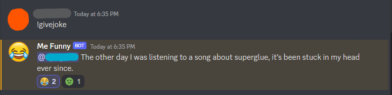

# Me-Funny-Bot
Enjoy the code to my Me Funny Bot and feel free to implement it to your own server to have a funny time!

## Commands

use **!givejoke** in your discord channel and recieve a funny random joke from a jokes API

## Features

- Make sure you vote with your friends on whether or not the joke made you laugh.
- Vote using the two reactions which will apear along with the joke (LOL or TROLL)
  - LOL (😂)
  - TROLL (🤢)

## Example

## Sources
For this bot, I used the [icanhazdadjoke](https://icanhazdadjoke.com/api) API for random jokes  
